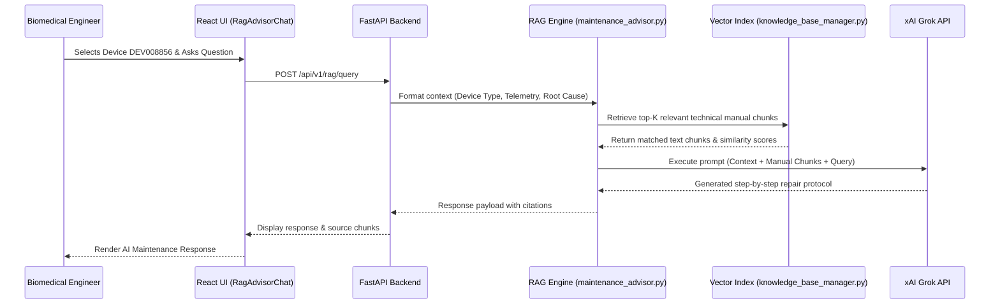

# 🏥 AURA INTELLIGENCE: AI-POWERED MEDICAL DEVICE RELIABILITY & PREDICTIVE MAINTENANCE PLATFORM
## End-to-End System Architecture, Machine Learning Pipeline & Technical Documentation

---

## 📋 Table of Contents
1. [Executive Overview & Problem Statement](#-executive-overview--problem-statement)
2. [Key System Features & Highlights](#-key-system-features--highlights)
3. [End-to-End Architecture & Data Flow](#-end-to-end-architecture--data-flow)
4. [Technology Stack](#-technology-stack)
5. [Role-Based Access Control (RBAC) & Security](#-role-based-access-control-rbac--security)
6. [Complete Frontend Pages & UI Components (11 Pages)](#-complete-frontend-pages--ui-components-11-pages)
7. [Backend Modules & Deep Dive File Directory](#-backend-modules--deep-dive-file-directory)
8. [Machine Learning Pipeline & Mathematical Models](#-machine-learning-pipeline--mathematical-models)
9. [Retrieval-Augmented Generation (RAG) & Grok AI Advisor](#-retrieval-augmented-generation-rag--grok-ai-advisor)
10. [Database Schema & Entity Relationship](#-database-schema--entity-relationship)
11. [Complete API Specification (All 29 Endpoints)](#-complete-api-specification-all-29-endpoints)
12. [Installation, Setup & Deployment Guide](#-installation-setup--deployment-guide)

---

## 📋 Executive Overview & Problem Statement

### **Problem Statement**
In modern healthcare facilities, unexpected failure of critical biomedical equipment (such as Ventilators, Patient Monitors, Pulse Oximeters, Dialysis Machines, and Infusion Pumps) poses severe risks to patient health and disrupts hospital workflows. Traditional maintenance strategies rely on **reactive repairs** (fixing machines after they break) or **fixed scheduled servicing** (which often misses sudden component degradation or performs unnecessary maintenance).

### **The Solution: AURA INTELLIGENCE**
**AURA Intelligence** is an enterprise-grade, multi-tenant Medical Device Reliability & Predictive Maintenance Platform. It aggregates real-time IoT sensor telemetry, applies an ensemble of **Machine Learning Classifier & Regression Models**, computes **Multi-Parameter Component Health Scores**, performs **TreeSHAP Explainable AI (XAI)** diagnostics, and utilizes a **RAG (Retrieval-Augmented Generation) LLM Technical Advisor** to deliver actionable maintenance protocols before equipment failure occurs.

---

## 🌟 Key System Features & Highlights

- **Multi-Tenant Data Isolation**: Hospital data is strictly partitioned by `hospital_id` with role-based JWT authentication.
- **5-Algorithm ML Model Ensemble**: Evaluates and benchmarks **Random Forest**, **CatBoost**, **LightGBM**, **XGBoost**, and **Logistic Regression**.
- **Weakest-Link Component Health Model**: Evaluates sub-system degradation across Battery, Control Board, Pump Chamber, Valves, and Sensors.
- **Dynamic Remaining Useful Life (RUL)**: Predicts exact days remaining before failure ($0.8\text{ to }90.0\text{ days}$).
- **TreeSHAP Explainable AI (XAI)**: Identifies positive and negative risk factors driving failure probability.
- **RAG Technical Manual Advisor**: Uses vector embeddings and xAI Grok API to provide step-by-step biomedical repair protocols.
- **Real-Time Telemetry Simulation & Replay**: Supports MQTT broker ingestion and simulated failure scenario replay ($0.5\text{x}$ to $5.0\text{x}$ speed).
- **Compliance Audit Logging**: Tracks all user logins, retrain events, alerts, and manual uploads.

---

## 🏗️ End-to-End Architecture & Data Flow

```mermaid
graph TD
    subgraph Client Layer
        A1["React.js Frontend UI (Vite)"]
        A2["Auth Overlay (AuthModal)"]
        A3["Alert Drawer (AlertInboxDrawer)"]
    end

    subgraph API & Gateway Layer
        B1["FastAPI Gateway (backend/api/main.py)"]
        B2["WebSocket Connection Manager"]
        B3["JWT Security & Role Checker (auth.py)"]
    end

    subgraph ML & Analytical Processing Layer
        C1["Inference Engine (inference.py)"]
        C2["Component Health Model (component_health.py)"]
        C3["Isolation Forest Anomaly Detector (anomaly_detection.py)"]
        C4["TreeSHAP Explainer Engine (shap_explainer.py)"]
        C5["Root Cause Reasoner (root_cause.py)"]
    end

    subgraph Data & RAG Storage Layer
        D1["SQLite Database (aura.db)"]
        D2["Model Artifacts (.pkl, metadata.json)"]
        D3["RAG Vector Index (knowledge_base_manager.py)"]
        D4["xAI Grok LLM API (grok_service.py)"]
    end

    subgraph Streaming & Ingestion Layer
        E1["MQTT Subscriber Service (mqtt_service.py)"]
        E2["Simulation Replay Engine (replay_engine.py)"]
    end

    A1 <-->|REST HTTP & JWT| B1
    A1 <-->|WebSockets (1000ms Stream)| B2
    B1 --> B3
    B1 --> C1
    C1 --> C2 & C3 & C4 & C5
    B1 --> D1 & D2 & D3 & D4
    E1 & E2 --> B2
```

---

## 🛠️ Technology Stack

| Layer | Technologies / Libraries Used | Purpose |
| :--- | :--- | :--- |
| **Frontend Framework** | React 18, Vite 8, Vanilla CSS (Glassmorphism), Lucide React | Single-Page Application (SPA), dynamic responsive layout |
| **Backend API Gateway** | Python 3.11, FastAPI, Uvicorn ASGI Server, Pydantic | Async REST APIs, WebSockets, OpenAPI documentation |
| **Database & Cache** | SQLite 3 (`data/aura.db`), In-Memory Dict Cache | Relational persistence & fast telemetry twin caching |
| **Machine Learning** | Scikit-Learn, CatBoost, LightGBM, XGBoost, SHAP, NumPy | Failure classification, RUL regression, anomaly detection |
| **LLM & RAG** | xAI Grok API, TF-IDF Vectorizer, Cosine Similarity | Manual parsing, chunking, and AI troubleshooting chat |
| **Streaming & IoT** | Paho-MQTT Client, Python Subprocessing Thread Pool | IoT sensor ingestion & historical telemetry replay |
| **Security** | PyJWT, Passlib (SHA256 / Bcrypt), HTTPBearer | JWT Token issuance, password verification, RBAC |

---

## 🔒 Role-Based Access Control (RBAC) & Security

The platform enforces strict role-based access control across **4 distinct hospital user profiles**. Pages are dynamically shown or hidden based on active permissions:

### **Credentials Matrix**

| Role Name | Email Address | Default Password | Page Restrictions & Access Rights |
| :--- | :--- | :--- | :--- |
| **👑 Hospital Admin** | `admin@gmail.com` | `Admin@123` | **Full System Access** (All 11 Pages Unlocked) |
| **🔧 BioMed Engineer** | `biomedeng@gmail.com` | `Biomed@123` | All pages **except** 🔒 `Dataset Upload` & 🔒 `Audit Logs` |
| **🏥 Clinical Operator** | `operator@gmail.com` | `Operator@123` | All pages **except** 🔒 `ML Predictor`, 🔒 `Benchmarks`, 🔒 `Telemetry Logs`, 🔒 `Dataset Upload` & 🔒 `Audit Logs` |
| **📄 Compliance Auditor** | `auditor@gmail.com` | `Auditor@123` | All pages **except** 🔒 `ML Predictor`, 🔒 `Telemetry Logs` & 🔒 `Dataset Upload` |

---

## 🖥️ Complete Frontend Pages & UI Components (11 Pages)

### 1. **Monitoring Dashboard** (`/dashboard` → `MonitoringDashboard.jsx`)
- Displays overall hospital reliability metrics, total monitored devices, active critical alerts, and average fleet health.
- **Monitored Fleet Predictive Intelligence Matrix Table**: Lists devices with Overall Health %, Failure Probability %, Risk Level badge, Dynamic RUL Days, Anomaly Score, Primary Root Cause, and an **`👁️ Inspect`** button.
- **AURA Predictive Inspector Card**: Detailed panel showing ML classifier outputs, RUL regression, anomaly breakdown, and RAG-recommended maintenance actions.

### 2. **Device Explorer** (`/explorer` → `DeviceExplorer.jsx`)
- Searchable, filterable catalog of all hospital equipment.
- Filters by Device ID, Device Type (Ventilator, Patient Monitor, Pulse Oximeter, etc.), Department, and Risk Level.
- Clicking **`Inspect Twin`** triggers direct navigation to Digital Twin View.

### 3. **Digital Twin View** (`/digitaltwin` → `DigitalTwinView.jsx`)
- Virtual twin representation of a selected medical device.
- **Device Health Gauge**: Overall health percentage ring chart.
- **Component Condition Map**: 5 individual sub-system condition cards (Battery, Control Board, Pump Chamber, Exhaust Valve, Sensors) showing health % and status.
- **Root Cause Analysis**: Displays primary failure hypothesis and confidence.
- **AI Predictive Risk Drivers (TreeSHAP Engine v2.4)**: Displays feature impact attribution scores (e.g. `+40% Health Boost`).

### 4. **Hospital Department Risk Overview** (`/heatmap` → `HospitalRiskHeatmap.jsx`)
- Aggregates operational status across 6 physical hospital departments:
  - **Intensive Care Unit (ICU)**
  - **Radiology Department**
  - **Operating Rooms (OR)**
  - **Clinical Laboratory**
  - **General Ward**
  - **Therapy & Rehab Center**
- Displays average department health %, risk tier distribution bar (`CRIT`, `HIGH`, `MED`, `LOW`), and sorted high-risk equipment rankings.

### 5. **Machine Failure ML Predictor** (`/predictor` → `MachineFailurePredictor.jsx`)
- Interactive direct prediction suite for custom equipment parameters.
- Allows selecting ML algorithms (Random Forest, CatBoost, LightGBM, XGBoost, Logistic Regression) to execute custom training and batch failure forecasts.

### 6. **RAG Advisor Chat** (`/advisor` → `RagAdvisorChat.jsx`)
- Intelligent conversational assistant powered by xAI Grok API and vector manual retrieval.
- Answers biomedical troubleshooting questions, recommends maintenance procedures, and cites source technical manual chunks.

### 7. **Model Benchmarks** (`/benchmarks` → `ModelBenchmarks.jsx`)
- Comparative analysis matrix evaluating 5 machine learning models.
- Compares **ROC-AUC**, **PR-AUC**, **Accuracy**, **Precision**, **Recall**, **F1-Score**, and **Training Time (sec)**.
- Features one-click **ML Pipeline Retraining** with live progress tracking.

### 8. **Live Telemetry Logs** (`/telemetry` → `LiveTelemetryLogs.jsx`)
- Real-time streaming log viewer displaying sensor metric updates.
- Supports historical simulation replay controls ($0.5\text{x}$ to $5.0\text{x}$ speed) and MQTT broker connectivity.

### 9. **Dataset Upload** (`/upload` → `DatasetUpload.jsx`)
- Custom CSV/XLS dataset ingestion module.
- Performs automatic column mapping, missing value handling, and dataset schema audit reports.

### 10. **Knowledge Base** (`/knowledge_base` → `KnowledgeBase.jsx`)
- Document ingestion center for technical service manuals and equipment guidelines.
- Allows inspecting parsed text chunks and vector similarity scores.

### 11. **Security & Audit Logs** (`/audit_logs` → `AuditLogs.jsx`)
- System-wide audit trail recording user logins, alert acknowledgements, dataset uploads, and retraining triggers.
- Features pagination and clear high-contrast dark text (`#0f172a`) for user email inspection.

---

## 📁 Backend Modules & Deep Dive File Directory

```
backend/
├── api/
│   └── main.py                     # FastAPI routes, WebSocket connection manager, REST endpoints
├── ml/                             # Machine Learning & Analytical Engines
│   ├── train_classifier.py         # Trains Random Forest / XGBoost / CatBoost failure classifiers
│   ├── train_rul.py                # Trains Remaining Useful Life regression model
│   ├── train_archive_model.py      # Computes comparative benchmark metrics matrix
│   ├── inference.py                # Multi-model risk evaluation & inference engine
│   ├── component_health.py         # Multi-parameter component degradation & weakest-link algorithm
│   ├── component_ontology.py       # Hardware component taxonomy and sensor parameter mapping
│   ├── anomaly_detection.py        # Isolation Forest anomaly score evaluator
│   ├── shap_explainer.py           # TreeSHAP feature attribution engine v2.4
│   ├── root_cause.py               # Diagnostic decision tree for primary root cause identification
│   ├── precompute_cache.py         # Fast in-memory virtual twin cache manager
│   └── simulated_hospital.py       # Synthetic telemetry signal generator for fleet devices
├── rag/                            # Retrieval-Augmented Generation Engine
│   ├── knowledge_base_manager.py   # Document parsing, text chunking, TF-IDF vector indexing
│   └── maintenance_advisor.py     # Prompt synthesis & Grok LLM maintenance advice engine
├── services/                       # Infrastructure & Background Services
│   ├── auth.py                     # JWT token encoding/decoding & password hashing
│   ├── grok_service.py             # xAI Grok API integration client
│   ├── mqtt_service.py             # Paho-MQTT broker subscriber client
│   └── inference_worker.py         # Background thread for live stream evaluation
├── streaming/                      # Telemetry Streaming & Simulation
│   ├── replay_engine.py            # Historical log replay controller
│   └── simulator.py                # Telemetry noise generator
├── knowledge_graph/
│   └── graph_engine.py             # Equipment component causal failure graph builder
├── data_pipeline/                  # Data Processing
│   ├── dataset_manager.py          # CSV upload handler
│   ├── build_feature_store.py      # Feature engineering & sliding window aggregator
│   └── data_audit.py               # Data validation report builder
├── config.py                       # Central system configuration & path settings
└── database.py                     # SQLite database setup, schema creation & audit logger
```

---

## 🧮 Machine Learning Pipeline & Mathematical Models

### 1. **Failure Probability Classifier ($P_{\text{fail}}$)**
- **Algorithms**: Ensemble of Random Forest, XGBoost, LightGBM, CatBoost.
- **Input**: 14+ sliding-window telemetry features (Mean, Standard Deviation, Variance, Min, Max, Trend Slopes).
- **Formula**:
  $$P_{\text{fail}} = \text{Model.predict\_proba}(X)[1] \in [0.0, 1.0]$$

### 2. **Remaining Useful Life (RUL Days)**
- **Algorithm**: Scikit-Learn RUL Regressor (`backend/ml/train_rul.py`).
- **Formula**:
  $$\text{RUL (Days)} = \max \left(0.8,\ \big(1.0 - P_{\text{fail}}\big) \times 90.0 \right)$$
- If $P_{\text{fail}} = 0.05$ ($5\%$), $\text{RUL} = 85.5\text{ days}$. If $P_{\text{fail}} = 0.982$ ($98.2\%$), $\text{RUL} = 1.6\text{ days}$.

### 3. **Overall Device Health & Weakest-Link Model**
- **Algorithm**: `backend/ml/component_health.py`.
- **Individual Component Health ($H_i$)**:
  $$H_i = 100 \times \max \left(0,\ 1 - \left( \frac{\text{Observed Telemetry} - \text{Baseline}}{\text{Tolerance Limit}} \right)^2 \right)$$
- **Combined Device Health**:
  $$\text{Device Health} = \min \left( \sum_{i=1}^{n} w_i \cdot H_i,\ \min_{i}(H_i) + \text{Safety Buffer} \right)$$
- If a critical component (e.g., Battery) drops to **21.2%**, the overall health is capped at **45.1%**, accurately reflecting real-world medical equipment risk.

### 4. **Isolation Forest Anomaly Score**
- **Algorithm**: `backend/ml/anomaly_detection.py`.
- Evaluates multidimensional sensor drift from normal operational clusters:
  $$\text{Anomaly Score} \in [0, 100]\quad (\text{Normal } < 35,\ \text{Warning } 35\text{–}60,\ \text{Abnormal } > 60)$$

### 5. **TreeSHAP Explainable AI (XAI)**
- **Algorithm**: `backend/ml/shap_explainer.py`.
- Computes Shapley values ($\phi_i$) for each feature to quantify exact positive/negative contributions to failure risk.

---

## 🧠 Retrieval-Augmented Generation (RAG) & Grok AI Advisor



---

## 🗄️ Database Schema & Entity Relationship

The SQLite database (`data/aura.db`) comprises 8 core tables initialized via `backend/database.py`:

```
+------------------+         +--------------------+         +-----------------------+
|      users       |         |      devices       |         |        alerts         |
+------------------+         +--------------------+         +-----------------------+
| user_id (PK)     |<------->| device_id (PK)     |<------->| alert_id (PK)         |
| username         |         | hospital_id (FK)   |         | device_id (FK)        |
| password_hash    |         | device_type        |         | risk_level            |
| role             |         | department         |         | failure_probability   |
| hospital_id      |         | manufacturer       |         | status ('active'/'ack')|
| department       |         | model              |         | timestamp             |
+------------------+         +--------------------+         +-----------------------+
                                       |
                                       v
                             +--------------------+
                             |   telemetry_logs   |
                             +--------------------+
                             | log_id (PK)        |
                             | device_id (FK)     |
                             | sensor_values (JSON|
                             | anomaly_score      |
                             | timestamp          |
                             +--------------------+
```

---

## 📡 Complete API Specification (All 29 Endpoints)

| # | HTTP Method | Endpoint Route | Description | Backend File |
| :--- | :--- | :--- | :--- | :--- |
| 1 | `POST` | `/api/v1/auth/login` | Authenticates user credentials & returns JWT | `backend/api/main.py` |
| 2 | `GET` | `/api/v1/auth/me` | Validates JWT token & returns active session | `backend/services/auth.py` |
| 3 | `GET` | `/api/v1/devices` | Returns paginated device fleet inventory | `backend/api/main.py` |
| 4 | `GET` | `/api/v1/devices/{id}/health` | Returns Digital Twin component condition map | `backend/ml/component_health.py` |
| 5 | `GET` | `/api/v1/live/devices` | Returns cached live device predictions | `backend/ml/precompute_cache.py` |
| 6 | `GET` | `/api/v1/live/logs` | Streams telemetry logs feed (200 items) | `backend/api/main.py` |
| 7 | `GET` | `/api/v1/live/alerts` | Fetches active risk alerts | `backend/api/main.py` |
| 8 | `POST` | `/api/v1/live/alerts/{id}/acknowledge` | Acknowledges alert & removes from active list | `backend/api/main.py` |
| 9 | `GET` | `/api/v1/departments` | Returns department risk overview & aggregates | `backend/api/main.py` |
| 10 | `WS` | `/api/v1/realtime/devices` | Persistent 1000ms telemetry WebSocket stream | `backend/services/inference_worker.py` |
| 11 | `GET` | `/api/v1/model/metadata` | Returns comparative 5-model benchmark metrics | `backend/ml/train_archive_model.py` |
| 12 | `POST` | `/api/v1/model/retrain` | Triggers background ML pipeline retraining | `backend/ml/train_classifier.py` |
| 13 | `GET` | `/api/v1/model/train-status` | Returns progress % of active retraining job | `backend/api/main.py` |
| 14 | `POST` | `/api/v1/model/direct-predict` | Runs direct inference for user parameters | `backend/ml/inference.py` |
| 15 | `POST` | `/api/v1/dataset/upload` | Uploads and parses custom CSV dataset | `backend/data_pipeline/dataset_manager.py` |
| 16 | `POST` | `/api/v1/dataset/map-columns` | Verifies column mapping to feature store | `backend/data_pipeline/build_feature_store.py` |
| 17 | `POST` | `/api/v1/dataset/validate-schema` | Audits missing values & schema quality | `backend/data_pipeline/data_audit.py` |
| 18 | `POST` | `/api/v1/rag/upload-manual` | Uploads technical service manuals for RAG | `backend/rag/knowledge_base_manager.py` |
| 19 | `GET` | `/api/v1/rag/documents` | Returns list of ingested technical manuals | `backend/rag/knowledge_base_manager.py` |
| 20 | `GET` | `/api/v1/rag/documents/{id}/chunks` | Inspects extracted manual text chunks | `backend/rag/knowledge_base_manager.py` |
| 21 | `POST` | `/api/v1/rag/query` | Queries AI maintenance advisor for procedures | `backend/rag/maintenance_advisor.py` |
| 22 | `GET` | `/api/v1/knowledge-graph/{id}` | Returns causal component failure graph | `backend/knowledge_graph/graph_engine.py` |
| 23 | `GET` | `/api/v1/audit/logs` | Returns security & compliance audit logs | `backend/database.py` |
| 24 | `POST` | `/api/v1/stream/mqtt/connect` | Connects backend to external MQTT broker | `backend/services/mqtt_service.py` |
| 25 | `POST` | `/api/v1/stream/replay/start` | Starts synthetic simulation log replay | `backend/streaming/replay_engine.py` |
| 26 | `POST` | `/api/v1/stream/replay/pause` | Pauses active log replay stream | `backend/streaming/replay_engine.py` |
| 27 | `POST` | `/api/v1/stream/replay/stop` | Stops active log replay stream | `backend/streaming/replay_engine.py` |
| 28 | `GET` | `/api/v1/stream/status` | Returns MQTT & replay status | `backend/api/main.py` |
| 29 | `GET` | `/api/v1/alerts` | Fallback endpoint for alerts list | `backend/api/main.py` |

---

## 🚀 Installation, Setup & Deployment Guide

### **1. System Prerequisites**
- Python `3.10` or `3.11`
- Node.js `20.19+` or `22+` & `npm`
- Git

### **2. Backend Setup**
```bash
# 1. Navigate to workspace root
cd "c:\Users\Dhamodaran G\Desktop\CTS"

# 2. Activate Virtual Environment
.venv\Scripts\activate

# 3. Install Python Dependencies (if needed)
pip install -r requirements.txt

# 4. Launch FastAPI Uvicorn Server
python -m uvicorn backend.api.main:app --host 0.0.0.0 --port 8000 --reload
```

### **3. Frontend Setup**
```bash
# 1. Open new terminal and navigate to frontend
cd "c:\Users\Dhamodaran G\Desktop\CTS\frontend"

# 2. Install NPM Packages
npm install

# 3. Start Vite Development Server
npm run dev
```

### **4. Access Application Interfaces**
- 🌐 **Web Dashboard**: `http://localhost:5173`
- 📑 **Swagger API Documentation**: `http://localhost:8000/docs`
- 📊 **ReDOC OpenAPI Specs**: `http://localhost:8000/redoc`

---

*AURA Intelligence Master System Documentation & Architectural Specification — Fully Detailed & Complete.*
