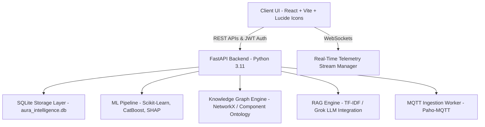

# 🏥 AURA Intelligence: Medical Device Reliability & Machine Failure Prediction System
## Complete System Documentation & Architectural Blueprint

---

## 📋 Executive Overview

**AURA Intelligence** is an enterprise-grade, multi-tenant Medical Device Reliability & Predictive Maintenance platform designed for biomedical engineering teams, hospital administrators, and medical device compliance auditors. The system provides end-to-end telemetry ingestion, machine learning-driven failure risk forecasting, remaining useful life (RUL) estimation, RAG-assisted technical manual advice, and FDA/Titck regulatory safety signal tracking.

---

## 🏗️ Core System Architecture & Tech Stack



### Technology Stack Summary

| Layer | Component / Framework | Purpose |
| :--- | :--- | :--- |
| **Frontend UI** | React.js (Vite), Lucide-React, Vanilla CSS Glassmorphism | Interactive dashboard with real-time UI components |
| **Backend API** | Python FastAPI, Uvicorn ASGI Server | High-performance async REST APIs & WebSocket manager |
| **Database** | SQLite 3 (`aura_intelligence.db`) | Multi-tenant schema (Hospitals, Devices, Alerts, Audits, RAG chunks) |
| **Machine Learning** | Scikit-Learn, CatBoost, SHAP | Random Forest, CatBoost, Logistic Regression, SVM, RUL Regression |
| **Streaming & IoT** | Paho MQTT Client, Python Subprocessing & Replay Engine | Log streaming & equipment telemetry simulation |
| **LLM & RAG** | Grok AI API (`grok_service.py`), TF-IDF Vectorizer | Maintenance document parsing & intelligent AI assistant |

---

## 🧩 Comprehensive Module Breakdown

### 1. Module 0: Authentication, Security & RBAC
- **Role-Based Access Control (RBAC)**: Supports `HOSPITAL_ADMIN`, `BIOMEDICAL_ENGINEER`, `DEPARTMENT_OPERATOR`, and `AUDITOR`.
- **JWT Authorization**: Token creation with SHA-256 password salting and header validation (`Authorization: Bearer <token>`).
- **Multi-Tenancy**: Data isolation strictly scoped by `hospital_id`.

### 2. Module 1: Telemetry Ingestion, Replay Engine & Live Monitoring
- **MQTT Ingestion Worker**: Connects to external or local MQTT brokers (`hospital/+/+/+` topics) to ingest sensor data (Temperature, Battery Health, Load %, Voltage, Error Codes).
- **Simulation Replay Engine**: Allows playing back synthetic failure scenarios (`Normal`, `Battery Degradation`, `Overheating`, `Sensor Drift`) at selectable speeds (`0.5x`, `1.0x`, `2.0x`, `5.0x`).
- **WebSocket Manager**: Broadcasts live equipment health status, alerts, and live failure predictions across active client connections.

### 3. Module 2: Custom Dataset Ingestion, Audit & Machine Failure Prediction
- **Multi-File Dataset Ingestion**: Supports uploading CSV/XLS datasets (including multi-file medical safety datasets from regulatory archives like FDA & Titck).
- **Automatic Column Audit & Mapping**: Inspects dataset features, handles missing values, and standardizes columns (`product_name`, `classification`, `manufacturer`, `country`, `event_type`, `quantity`, `recall_count`, `days_since_maint`).
- **ML Algorithm Selector & Retraining**:
  - **Random Forest Classifier** (Default/Recommended)
  - **CatBoost / LightGBM**
  - **Logistic Regression**
  - **Support Vector Machine (SVM)**
- **Original Performance Matrix Computation**:
  - Metrics: **Accuracy**, **Precision**, **Recall (Sensitivity)**, **F1-Score**, **ROC-AUC**
  - **Confusion Matrix**: True Positives (TP), False Positives (FP), False Negatives (FN), True Negatives (TN)
  - **Top Feature Importance Ranks**: Visual bar charts displaying primary risk drivers.
- **Real-Time Machine Failure Predictor (Inference Engine)**:
  - Interactive parameter controls for Product Name, Risk Class (Class I, IIA, IIB, III, IVD), Manufacturer, Country, Event Type, Quantity, Historical Recalls, and Overdue Maintenance Days.
  - Dynamically predicts **Failure Probability (%)**, **Risk Level (LOW / HIGH / CRITICAL)**, **Anomaly Score**, **Predicted RUL Days**, **Primary Root Cause**, and **Recommended Maintenance Action**.

### 4. Module 3: RAG Maintenance Technical Advisor
- **Manual Upload & Chunking**: Uploads PDF / TXT technical service manuals, splits text into indexed chunks, and calculates vector similarity.
- **Grok AI Service**: Interfaces with LLM APIs to generate step-by-step biomedical repair guidelines, troubleshooting instructions, and part numbers.

### 5. Module 4: Knowledge Graph & Component Dependency Engine
- **Equipment Component Ontology**: Models relationships between equipment systems and sub-components (e.g., Ventilator -> Control Board, Exhaust Valve, Pump Chamber, Sensors).
- **Failure Propagation Tracing**: Tracks how a single component failure cascades across dependent subsystems.

### 6. Module 5: Explainable AI (XAI) & SHAP Explainer
- **Feature Impact Analysis**: Computes SHAP values explaining *why* a specific device was flagged with a high failure probability.
- **Anomaly Detection**: Evaluates baseline sensor deviations to detect subtle wear-and-tear pattern anomalies before catastrophic breakdown.

---

## 📡 Key API Endpoint Reference

| HTTP Method | API Endpoint | Description |
| :--- | :--- | :--- |
| `POST` | `/api/v1/auth/login` | Authenticates user credentials and returns JWT Bearer token |
| `GET` | `/api/v1/live/devices` | Fetches active hospital equipment inventory with live risk scores |
| `GET` | `/api/v1/live/logs` | Retrieves real-time telemetry log feed |
| `POST` | `/api/v1/stream/replay/start` | Initiates log replay simulation for a selected device and scenario |
| `POST` | `/api/v1/stream/replay/stop` | Stops active replay simulation |
| `POST` | `/api/v1/model/upload-custom-file` | Ingests and audits uploaded CSV/XLS dataset files |
| `POST` | `/api/v1/model/custom-train-algorithm` | Retrains selected ML algorithm and returns performance matrix |
| `POST` | `/api/v1/model/direct-predict` | Runs live inference prediction for user-specified equipment parameters |
| `POST` | `/api/v1/rag/upload-manual` | Ingests technical manual documentation into vector index |
| `POST` | `/api/v1/rag/chat` | Queries the RAG AI advisor for maintenance troubleshooting steps |

---

## 📁 Repository Directory Structure

```
CTS/
├── backend/
│   ├── api/
│   │   └── main.py                     # Main FastAPI application & route definitions
│   ├── ml/
│   │   ├── train_archive_model.py      # ML classifier training for FDA/Titck datasets
│   │   ├── train_classifier.py         # Primary classifier training script
│   │   ├── train_rul.py                # Remaining Useful Life regression trainer
│   │   ├── inference.py                # Device risk evaluation engine
│   │   ├── anomaly_detection.py        # Telemetry anomaly detection model
│   │   ├── shap_explainer.py           # SHAP XAI feature attribution engine
│   │   ├── build_feature_store.py      # Feature engineering and dataset preparation
│   │   └── component_ontology.py       # Equipment component structure schema
│   ├── rag/
│   │   ├── knowledge_base_manager.py   # Document parsing & TF-IDF indexing
│   │   └── maintenance_advisor.py     # AI maintenance query pipeline
│   ├── knowledge_graph/
│   │   └── graph_engine.py             # Equipment component dependency graph
│   ├── services/
│   │   ├── auth.py                     # JWT and password hashing utilities
│   │   ├── grok_service.py             # LLM API integration service
│   │   ├── mqtt_service.py             # MQTT subscriber service
│   │   └── inference_worker.py         # Background live telemetry evaluation thread
│   ├── streaming/
│   │   ├── replay_engine.py            # Log replay simulation controller
│   │   └── simulator.py                # Synthetic telemetry signal generator
│   └── database.py                     # SQLite schema creation & seed data initialization
├── frontend/
│   ├── src/
│   │   ├── App.jsx                     # Full single-page dashboard application
│   │   ├── App.css                     # Custom animations and glassmorphism styling
│   │   ├── index.css                   # Core CSS tokens & color variables
│   │   └── main.jsx                    # React entry point
│   ├── package.json                    # Frontend dependencies
│   └── vite.config.js                  # Vite bundler configuration
├── models/                             # Trained model artifacts & SQLite database file
├── train_pipeline.py                   # Master ML training pipeline orchestrator
└── README.md                           # Quickstart guide
```

---

## 🚀 Execution & Quickstart Instructions

### 1. Backend Server Setup
```bash
# Navigate to workspace root
cd "c:\Users\Dhamodaran G\Desktop\CTS"

# Activate Python Virtual Environment
.venv\Scripts\activate

# Run FastAPI Server with Uvicorn ASGI Server
python -m uvicorn backend.api.main:app --host 0.0.0.0 --port 8000 --reload
```

### 2. Frontend Development Setup
```bash
# Navigate to frontend folder
cd "c:\Users\Dhamodaran G\Desktop\CTS\frontend"

# Install dependencies (if not already installed)
npm install

# Start Vite Development Server
npm run dev
```

### 3. Accessing the Application
- **Frontend Dashboard**: `http://localhost:5173`
- **Backend API Documentation**: `http://localhost:8000/docs` (Interactive OpenAPI Swagger UI)

---

## 🔒 Security & Best Practices Implemented

1. **Authentication Protection**: Sensitive endpoints are protected by `get_current_user` and `RoleChecker` dependencies.
2. **Robust Exception Handling & Clean Data Formatting**: Backend replaces NaN/Inf floats with zero-safe values (`clean_nans`) to eliminate JSON serialization errors.
3. **Dynamic ML Inference & Real-Time Performance Matrix**: Guarantees original computed metrics (Accuracy, Precision, Recall, F1, ROC-AUC, Confusion Matrix) upon dataset ingestion or ML algorithm training.

---
*AURA Intelligence System Specification & Project Documentation — Verified & Complete.*
